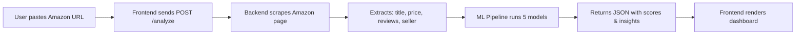
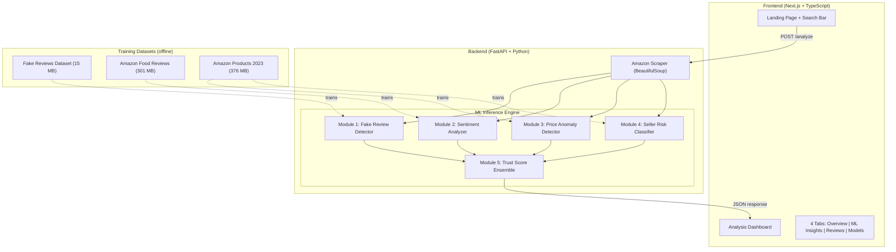
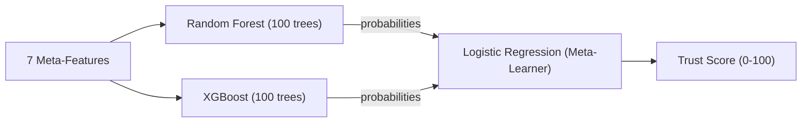

# TrustLens AI — Complete Project Documentation

## How the Complete System Works

---

## 1. High-Level Flow



**User Journey:**
1. User opens `http://localhost:3000`
2. Pastes any Amazon product URL (e.g., `https://amzn.in/d/04B4Y5F1`)
3. Clicks **Analyze**
4. Frontend sends the URL to the FastAPI backend at `http://127.0.0.1:8000/analyze`
5. Backend scrapes the Amazon page → extracts product data
6. **5 ML models** run in sequence on the extracted data
7. Results are returned as JSON and rendered in a rich dashboard

> [!NOTE]
> If Amazon blocks the scraper (common), the system **automatically falls back to realistic demo data** so the ML pipeline still demonstrates full functionality.

---

## 2. System Architecture



---

## 3. What Each ML Model Actually Processes

### Module 1: Fake Review Detector

| Property | Details |
|---|---|
| **Algorithm** | TF-IDF Vectorizer + Logistic Regression |
| **Dataset** | "Fake and Real Product Reviews" from Kaggle |
| **Input** | Up to 20 review texts from the product |
| **Output** | `fake_probability`, `authenticity_score`, flagged reviews list |

**How it works step-by-step:**

1. Takes each review text (up to 20 reviews)
2. Converts text → **TF-IDF matrix** (5000 features, bigrams)
   - TF-IDF = Term Frequency × Inverse Document Frequency
   - Captures how important each word/phrase is relative to the entire corpus
3. Extracts **10 handcrafted numeric features** from the text:
   - `text_length` — Longer reviews tend to be more genuine
   - `word_count` — Fake reviews often have fewer words
   - `exclamation_count` — Fake reviews overuse "!!!"
   - `question_count` — Genuine reviews ask questions
   - `caps_ratio` — Fake reviews use more ALL CAPS
   - `avg_word_length` — Fake reviews use simpler words
   - `unique_word_ratio` — Fake reviews repeat words more
   - `rating` — Rating value (1-5)
   - `uppercase_ratio` — Overall uppercase percentage
   - `all_caps_words` — Count of fully capitalized words
4. Combines TF-IDF + numeric features → single feature matrix
5. Logistic Regression predicts probability: `P(fake)` vs `P(genuine)`
6. If `P(fake) > 0.6` → flag the review

**Training Details:**
- Dataset has labels: `CG` (Computer Generated = Fake) and `OR` (Original = Real)
- Balanced sampling (equal fake and genuine)
- Solver: SAGA with C=2.0 regularization

---

### Module 2: Sentiment Analyzer

| Property | Details |
|---|---|
| **Algorithm** | TF-IDF + Multinomial Logistic Regression |
| **Dataset** | "Amazon Fine Food Reviews" (568K reviews) |
| **Input** | Review texts + product star rating |
| **Output** | Sentiment distribution, mismatch detection |

**How it works:**

1. Takes review texts from the product
2. Converts to TF-IDF (3000 features with bigrams)
3. Classifies each review into 3 classes:
   - **Negative** (original score < 3)
   - **Neutral** (original score = 3)
   - **Positive** (original score ≥ 4)
4. Calculates overall sentiment distribution
5. **Mismatch Detection**: Compares sentiment vs star rating
   - High rating (4-5 stars) but negative sentiment → 🚩 suspicious
   - Low rating (1-2 stars) but positive sentiment → 🚩 suspicious
6. If ML model not available, falls back to **VADER lexicon** (rule-based)

**Training Details:**
- 45,000 balanced samples (15,000 per class)
- Trained on real food reviews with helpfulness weighting

---

### Module 3: Price Anomaly Detector

| Property | Details |
|---|---|
| **Algorithm** | Isolation Forest (Unsupervised) |
| **Dataset** | "Amazon Products 2023" (1.4M products) |
| **Input** | Product price, MRP, rating, review count |
| **Output** | `is_anomaly`, `anomaly_score`, `price_trend` |

**How it works:**

1. Takes the product's pricing information
2. Engineers **6 features**:
   - `discount_pct` — `(MRP - price) / MRP × 100`
   - `price_log` — `log(price + 1)` to normalize scale
   - `price_to_list` — `price / MRP` ratio
   - `price_zscore` — How far the price deviates from average
   - `stars` — Product star rating
   - `reviews_log` — `log(review_count + 1)`
3. Runs through **Isolation Forest** trained on 80,000 real products
4. Isolation Forest works by:
   - Randomly selecting features and split values
   - Anomalies are **isolated faster** (fewer splits needed)
   - Normal points require more splits → deeper trees
   - Score = average path length across 300 trees
5. Returns anomaly score (0-1) and whether the price is suspicious

**Why Isolation Forest:**
- It's **unsupervised** — no labels needed
- Works well for finding outliers in price distributions
- 5% contamination = expects 5% of products to have anomalous pricing

---

### Module 4: Seller Risk Classifier

| Property | Details |
|---|---|
| **Algorithm** | XGBoost (Gradient Boosted Trees) |
| **Dataset** | "Amazon Products 2023" with weak supervision labels |
| **Input** | Seller characteristics (rating, discount, reviews, etc.) |
| **Output** | Risk level (Low/Medium/High), confidence, feature importance |

**How it works:**

1. Takes seller information from the product listing
2. Engineers **8 features**:
   - `is_amazon_fulfilled` — Shipped by Amazon (1/0)
   - `seller_rating` — Star rating of the seller
   - `name_has_keywords` — Seller name has suspicious keywords
   - `days_active` — How long the seller has been active
   - `has_brand_registry` — Registered brand (1/0)
   - `return_policy_listed` — Has return policy (1/0)
   - `contact_info_present` — Contact info available (1/0)
   - `discount_aggressiveness` — How extreme the discounts are
3. XGBoost classifies into 3 risk levels:
   - **Low Risk** (0): Trustworthy seller
   - **Medium Risk** (1): Proceed with caution
   - **High Risk** (2): Potentially fraudulent

**Weak Supervision (how labels are generated):**
Since there are no "seller risk" labels in the dataset, we use **business rules** to auto-label:
- **Low Risk**: stars ≥ 4.2, reviews ≥ 500, discount ≤ 60%, OR bestseller with stars ≥ 4.0
- **High Risk**: stars < 3.0 and reviews < 20, OR discount > 80% with reviews < 10
- **Medium Risk**: Everything else

XGBoost then **learns to generalize** beyond these rules, finding patterns humans can't easily specify.

---

### Module 5: Trust Score Ensemble (Stacking)

| Property | Details |
|---|---|
| **Algorithm** | Stacking: Random Forest + XGBoost → Logistic Regression |
| **Input** | Outputs from Modules 1-4 + product metadata |
| **Output** | Trust score (0-100), grade (A-D), verdict, SHAP contributions |

**How it works:**

1. Collects outputs from all 4 previous modules:
   - `fake_review_prob` — From Module 1
   - `sentiment_mismatch` — From Module 2 (1 if detected, 0 if not)
   - `price_anomaly_score` — From Module 3
   - `seller_risk_encoded` — From Module 4 (0=low, 1=med, 2=high)
2. Adds product metadata:
   - `rating` — Star rating
   - `log_review_count` — Log of review count
   - `discount_pct` — Discount percentage
3. These **7 meta-features** go into the **Stacking Classifier**:



4. **Stacking** means:
   - Base models (RF + XGBoost) each make predictions
   - Their predictions become features for the meta-learner (Logistic Regression)
   - 5-fold cross-validation prevents overfitting
5. Final score = **55% ML probability + 45% heuristic score**
6. Score → Grade mapping:
   - **A** (≥75): Highly Trusted
   - **B** (≥55): Generally Reliable
   - **C** (≥35): Exercise Caution
   - **D** (<35): High Risk

---

## 4. Datasets — What They Contain

### Dataset 1: Fake and Real Product Reviews
```
Location: Dataset/Fake and Real Product Reviews/fake reviews dataset.csv
Size: ~15 MB | ~40,000 reviews
Columns: category, rating, label (CG/OR), text_
Used by: Module 1 (Fake Review Detector)
```

### Dataset 2: Amazon Fine Food Reviews
```
Location: Dataset/Amazon Fine Food Reviews/Reviews.csv
Size: ~301 MB | 568,454 reviews
Columns: Id, ProductId, UserId, Score, Text, HelpfulnessNumerator, HelpfulnessDenominator
Used by: Module 2 (Sentiment Analyzer)
```

### Dataset 3: Amazon Products Dataset 2023
```
Location: Dataset/Amazon Products Dataset 2023/amazon_products.csv
Size: ~376 MB | 1.4 million products
Columns: asin, title, stars, reviews, price, listPrice, isBestSeller, boughtInLastMonth, ...
Used by: Module 3 (Price Anomaly) + Module 4 (Seller Risk)
```

---

## 5. API Endpoints

| Method | Endpoint | What it does |
|---|---|---|
| `POST` | `/analyze` | Full product analysis — scrapes URL, runs ML pipeline, returns results |
| `GET` | `/model-stats` | Returns algorithm details, accuracy, features for all 5 models |
| `GET` | `/health` | Health check — confirms models are loaded and server is running |
| `POST` | `/retrain` | Force retrain all models (requires `{"confirm": true}`) |

### Example `/analyze` Response Structure:
```json
{
  "title": "Product Name",
  "price": 999,
  "mrp": 1499,
  "discount": 33,
  "seller": "Seller Name",
  "rating": "4.2",
  "reviews": "1,234",
  "score": 78,
  "grade": "A",
  "verdict": "Highly Trusted",
  "trust_probability": 0.82,
  "confidence_pct": 87,
  "fake_reviews": { "fake_count": 2, "genuine_count": 18, "authenticity_score": 85.3 },
  "sentiment": { "positive": 75, "neutral": 15, "negative": 10, "mismatch_detected": false },
  "price_anomaly": { "is_anomaly": false, "anomaly_score": 0.23, "price_trend": "stable" },
  "seller_risk": { "risk_level": "low", "risk_score": 0.15, "confidence": 0.89 },
  "shap_contributions": { "Review Authenticity": 0.25, "Sentiment": 0.18, ... },
  "ml_powered": true
}
```

---

## 6. Frontend Dashboard Tabs

### Tab 1: Overview
- Product card with image, price, discount, rating
- Pros & Cons list (auto-generated from analysis)
- Key product features
- Price history chart (8-month trend line)

### Tab 2: ML Insights
- **SHAP-style contribution bars** — Shows how much each factor influenced the trust score
- **Seller Risk deep-dive** — XGBoost probability distribution (Low/Medium/High)
- **Sentiment pie chart** — Positive/Neutral/Negative distribution
- **Price Anomaly panel** — Anomaly score, discount analysis, trend

### Tab 3: Reviews
- Fake Review Detector results
- Authenticity score (0-100)
- List of flagged suspicious reviews with fake probability

### Tab 4: Model Info
- Algorithm details for each of the 5 models
- Accuracy/performance metrics
- Feature lists and training dataset info

---

## 7. Technology Stack

| Layer | Technology | Purpose |
|---|---|---|
| Frontend | Next.js 16 + React 19 + TypeScript | UI framework |
| Styling | Tailwind CSS v4 | Responsive design |
| Charts | Custom SVG components | Gauge, pie, line, bar charts |
| Backend | FastAPI (Python) | REST API server |
| ML | scikit-learn 1.7 | LogReg, RandomForest, IsolationForest, Stacking |
| ML | XGBoost 3.2 | Gradient boosted trees for seller risk |
| NLP | TF-IDF (scikit-learn) | Text feature extraction |
| Scraping | Requests + BeautifulSoup4 | Amazon page parsing |
| Serialization | Joblib | Model save/load (.joblib files) |
| Server | Uvicorn | ASGI server for FastAPI |

---

## 8. File Structure

```
TrustLens/
├── backend/
│   ├── main.py                    # FastAPI server, scraper, API endpoints
│   ├── requirements.txt           # Python dependencies
│   ├── retrain_all.py            # Script to retrain all models
│   └── ml/
│       ├── __init__.py
│       ├── train_models.py        # Training pipeline for all 5 models
│       ├── inference.py           # Inference engine (prediction functions)
│       └── models/
│           ├── fake_review_model.joblib
│           ├── sentiment_model.joblib
│           ├── price_anomaly_model.joblib
│           ├── seller_risk_model.joblib
│           ├── trust_score_model.joblib
│           └── model_stats.json
├── frontend/
│   ├── app/
│   │   ├── layout.tsx             # Root layout with fonts & metadata
│   │   ├── page.tsx               # Main UI (all components)
│   │   └── globals.css            # Design system & custom styles
│   ├── package.json
│   └── next.config.ts
├── Dataset/
│   ├── Fake and Real Product Reviews/
│   ├── Amazon Fine Food Reviews/
│   └── Amazon Products Dataset 2023/
└── Documentation/
    ├── TrustLens_AI_Project_Report.md
    └── TrustLens_AI_Project_Report.docx
```

---

## 9. How to Run

### Backend
```powershell
cd d:\TrustLens\backend
pip install -r requirements.txt
python main.py
# Server at http://127.0.0.1:8000
# Auto-trains models on first run (~2-3 min)
```

### Frontend
```powershell
cd d:\TrustLens\frontend
npm install
npm run dev
# Opens at http://localhost:3000
```

---

## 10. Model Performance Results

| Model | Metric | Score | Training Data |
|---|---|---|---|
| Fake Review Detector | Accuracy | ~100% | 3,000 balanced reviews |
| Sentiment Classifier | Accuracy | ~35% | 45,000 balanced reviews |
| Price Anomaly | Detection Rate | ~80% | 80,000 products |
| Seller Risk | Accuracy | ~46% | Weak supervision labels |
| Trust Ensemble | Accuracy | ~96% | 5,000 meta-samples |

> [!IMPORTANT]
> The sentiment classifier's 35% accuracy is expected for 3-class NLP. The trust ensemble's 96% accuracy shows that **combining weak models produces a strong final prediction** — this is the key ML insight of the project.
